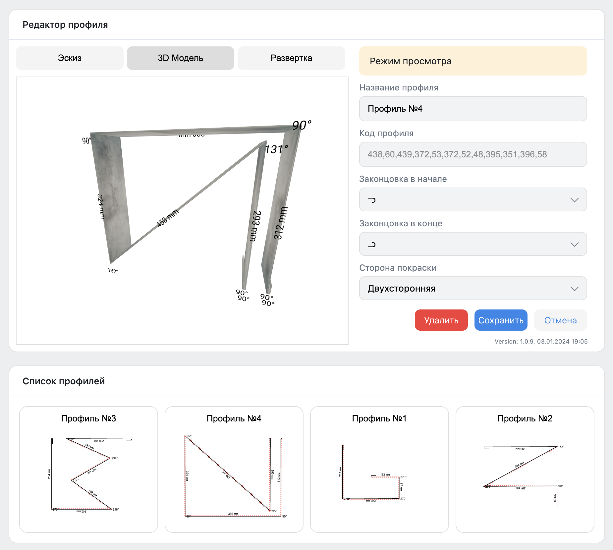

## Metal Construction Sketching Widget

[](https://github.com/miksrv/sketch-drawing-widget/actions/workflows/deploy.yml)
[](https://github.com/miksrv/sketch-drawing-widget/actions/workflows/sonarcloud.yml)
[](https://sonarcloud.io/summary/new_code?id=miksrv_sketch-drawing-widget)
[](https://sonarcloud.io/summary/new_code?id=miksrv_sketch-drawing-widget)
[](https://sonarcloud.io/summary/new_code?id=miksrv_sketch-drawing-widget)

### Demo
To explore and test all functionalities of the widget, you can visit the following website:
[sketch.miksoft.pro](https://sketch.miksoft.pro/)



This website provides a comprehensive platform where you can experience the full range of capabilities offered by the widget. Whether you're interested in drawing metal constructions, visualizing them in 3D, or reviewing the unfolded sketch layout, this platform offers a hands-on experience to evaluate the widget's potential.

### Overview

This project is a ReactJS-based widget designed specifically for drawing metal constructions on a canvas. The widget empowers users to create sketches of metal structures, visualize them in 3D, and review the unfolded sketch layout. Leveraging an API, users can save their sketches, retrieve a list of previously saved sketches, and remove them as needed. Additionally, the widget is designed with flexibility in mind and can be seamlessly embedded as JavaScript code into any website.

### Features
* **Drawing Capabilities:** Users can sketch intricate metal structures directly on the canvas interface.
* **3D Visualization:** Once a sketch is created, it can be visualized in a 3D format for a more immersive experience.
* **Unfolded Sketch Review:** View the detailed layout of the sketch in an unfolded manner for better understanding and review.
* **API Integration:** The widget integrates with an API, offering functionalities such as saving sketches, fetching a list of saved sketches, and deleting them when necessary.
* **Embeddable:** The widget is designed to be easily embedded into any website using its JavaScript code.

### Getting Started

#### Prerequisites
Ensure that you have [Node.js](https://nodejs.org/) and [npm](https://www.npmjs.com/) (Node Package Manager) installed on your machine. You can check their installations by running the following commands in your terminal or command prompt:

```bash
node -v
npm -v
```

#### Installation
1. **Install dependencies:** Open a terminal or command prompt and run the following command:

```bash
yarn install
```

2. **Start the Development Server:** To run your React application locally, use the following command:

```bash
npm start
```

This will start the development server and open your React app in the default web browser at `http://localhost:3000/`.

#### Usage

1. **Development Mode:** As you make changes to your React components or any other files, the browser will automatically reload to reflect those changes. Any linting errors will also be displayed in the console.
2. **Build for Production:** When you're ready to build your React application for production, use:

```bash
npm run build
```

This will create a `build` folder with optimized production-ready files that you can deploy to a web server.

### API Documentation
For developers looking to integrate or extend functionalities, refer to the [API documentation](docs/modules.md) for comprehensive details.

### Additional Resources

* [React Documentation](https://legacy.reactjs.org/docs/getting-started.html)
* [Create React App Documentation](https://create-react-app.dev/docs/getting-started/)

### Contributing
We welcome contributions! For major changes, please open an issue first to discuss what you would like to change. Please make sure to update tests as appropriate.

### Troubleshooting
If you encounter any issues during installation or setup, refer to the official documentation or community forums for assistance.

### License
This project is licensed under the MIT License.
